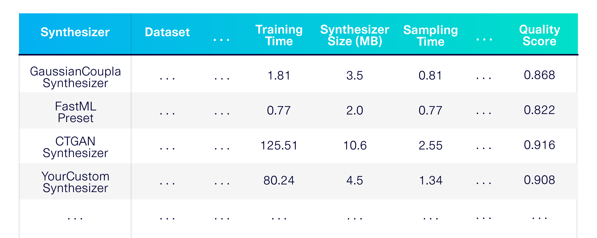

<div align="center">
<br/>
<p align="center">
    <i>This repository is part of <a href="https://sdv.dev">The Synthetic Data Vault Project</a>, a project from <a href="https://datacebo.com">DataCebo</a>.</i>
</p>

[](https://pypi.org/search/?c=Development+Status+%3A%3A+2+-+Pre-Alpha)
[](https://travis-ci.org/sdv-dev/SDGym)
[](https://pypi.python.org/pypi/sdgym)
[](https://pepy.tech/project/sdgym)
[](https://bit.ly/sdv-slack-invite)

<div align="left">
<br/>
<p align="center">
<a href="https://github.com/sdv-dev/SDGym">
</img>
</a>
</p>
</div>

</div>

# Overview

The Synthetic Data Gym (SDGym) is a benchmarking framework for modeling and generating
synthetic data. Measure performance and memory usage across different synthetic data modeling
techniques – classical statistics, deep learning and more!

</img>

The SDGym library integrates with the Synthetic Data Vault ecosystem. You can use any of its
synthesizers, datasets or metrics for benchmarking. You can also customize the process to include
your own work.

* **Datasets**: Select any of the publicly available datasets from the SDV project, or input your own data.
* **Synthesizers**: Choose from any of the SDV synthesizers and baselines. Or write your own custom
machine learning model.
* **Evaluation**: In addition to performance and memory usage, you can also measure synthetic data
quality and privacy through a variety of metrics.

# Install

Install SDGym using pip or conda. We recommend using a virtual environment to avoid conflicts with other software on your device.

```bash
pip install sdgym
```

```bash
conda install -c pytorch -c conda-forge sdgym
```

For more information about using SDGym, visit the [SDGym Documentation](https://docs.sdv.dev/sdgym).

# Usage

Let's benchmark synthetic data generation for single tables. First, let's define which modeling
techniques we want to use. Let's choose a few synthesizers from the SDV library and a few others
to use as baselines.

```python
# these synthesizers come from the SDV library
# each one uses different modeling techniques
sdv_synthesizers = ['GaussianCopulaSynthesizer', 'CTGANSynthesizer']

# these basic synthesizers are available in SDGym
# as baselines
baseline_synthesizers = ['UniformSynthesizer']
```

Now, we can benchmark the different techniques:
```python
import sdgym

sdgym.benchmark_single_table(
    synthesizers=(sdv_synthesizers + baseline_synthesizers)
)
```

The result is a detailed performance, memory and quality evaluation across the synthesizers
on a variety of publicly available datasets.

## Supplying a custom synthesizer

Benchmark your own synthetic data generation techniques. Define your synthesizer by
specifying the training logic (using machine learning) and the sampling logic.

```python
def my_training_logic(data, metadata):
    # create an object to represent your synthesizer
    # train it using the data
    return synthesizer

def my_sampling_logic(trained_synthesizer, num_rows):
    # use the trained synthesizer to create
    # num_rows of synthetic data
    return synthetic_data
```

Learn more in the [Custom Synthesizers Guide](https://docs.sdv.dev/sdgym/customization/synthesizers/custom-synthesizers).

## Customizing your datasets

The SDGym library includes many publicly available datasets that you can include right away.
List these using the ``get_available_datasets`` feature.

```python
sdgym.get_available_datasets()
```

```
dataset_name   size_MB     num_tables
KRK_v1         0.072128    1
adult          3.907448    1
alarm          4.520128    1
asia           1.280128    1
...
```

You can also include any custom, private datasets that are stored on your computer on an
Amazon S3 bucket.

```
my_datasets_folder = 's3://my-datasets-bucket'
```

For more information, see the docs for [Customized Datasets](https://docs.sdv.dev/sdgym/customization/datasets).

# What's next?

Visit the [SDGym Documentation](https://docs.sdv.dev/sdgym) to learn more!

---


<div align="center">
<a href="https://datacebo.com"></img></a>
</div>
<br/>
<br/>

[The Synthetic Data Vault Project](https://sdv.dev) was first created at MIT's [Data to AI Lab](
https://dai.lids.mit.edu/) in 2016. After 4 years of research and traction with enterprise, we
created [DataCebo](https://datacebo.com) in 2020 with the goal of growing the project.
Today, DataCebo is the proud developer of SDV, the largest ecosystem for
synthetic data generation & evaluation. It is home to multiple libraries that support synthetic
data, including:

* 🔄 Data discovery & transformation. Reverse the transforms to reproduce realistic data.
* 🧠 Multiple machine learning models -- ranging from Copulas to Deep Learning -- to create tabular,
  multi table and time series data.
* 📊 Measuring quality and privacy of synthetic data, and comparing different synthetic data
  generation models.

[Get started using the SDV package](https://sdv.dev/SDV/getting_started/install.html) -- a fully
integrated solution and your one-stop shop for synthetic data. Or, use the standalone libraries
for specific needs.
