# SDGym

Synthetic Data Gym: A framework to benchmark the performance of synthetic data generators for non-temporal tabular data.

# Getting started

## Installation

To install `SDGym` you only need to fork the repository, clone it and install its requirements

```
git clone git@github.com:$YOUR_USERNAME/SDGym.git
cd SDGym/
pip install -r requirements.txt
```

## Data requirements

### Input Format

The input for all the synthesizers includecd in `SDGym` is a couple of files:

- A `npz` file containing two tables, `train` and `test`, where each is a `numpy.ndarray`. All continous columns are stored as is, while categorical and ordinal columns are stored using integers, altought the dtype will be float because numpy does not support mixed types.

- A `json` file containing the metadata for the dataset, that is, information about the columns, like the max and minimum values on continous columns or the mapping from integer to string in categorical columns.

```
[
	{
		'name': None or str
		'type': 'Ordinal' or 'Categorical' or 'Continuous'

		# if Ordinal or Categorical
		'size': integer
		'i2s': list of str

		# if Continuous
		'min': float
		'max': float
	},
	...
]

```

### Output Format

The results from `SDGym` are stored in the `output` folder with the following structure:

```
output
   __results__
       $MODEL.json	# Raw scores for model $MODEL
       ...

   __summaries__
      result.csv	# Table summary of the results
      barchart_$MODEL	# Bar chart for model $MODEL
      ...
```


### Demo Datasets

`SDGym` includes a few datasets to use for development or demonstration purposes. These datasets have been preprocessed to be ready to use with `SDGym`, following the requirements specified in the [Input Format](#input-format) section.

These datasets can be downloaded [here](https://s3.amazonaws.com/sdgym/SDGymBenchmarkData.zip).
After downloaded


To run this benchmark, you should first download all the data from dropbox and store them in `data` folder. So the whole working folder should look like

```
SDGym
 |-data/
 |  |
 |  |--real/
 |  |  |
 |  |  |--rdata1.npz
 |  |  |
 |  |  |--rdata1.json
 |  |  |
 |  |  |-- ...
 |  |
 |  |--simulate/
 |      |
 |      |--sdata1.npz
 |      |
 |      |--sdata1.json
 |      |
 |      |--...
 |
 |-synthetic_data_benchmark/
 |-output/
```


## Quickstart

In the following steps we will show how to run SDGym to evaluate 

# Benchmark Framework

- Preprocess and get clean synthetic and real data sets. All code should goto `synthetic_data_benchmark /sdata_maker` and `synthetic_data_benchmark/rdata_maker`. (Once done, everything will be uploaded to S3, so that data are fixed for future use.
- `synthetic_data_benchmark/synthesizer/` contains several baseline synthesizers. Each synthesizer can be easily excuted on one or more datasets multiple times by
	-`> python3 -m synthetic_data_benchmark.synthesizer.xxx_synthesizer --repeat 3 [dataset1, dataset2, ...]`
	- Excution results are stored in `output/` as several npz files. Each one is one version of synthetic data.
- Evaluators
	- `synthetic_data_benchmark/evaluator/evaluate.py` evaluates the output of one synthesizer on all datasets and store in a json file.
		- `> python3 -m synthetic_data_benchmark.evaluator.evaluate output/XxxSynthesizer`
		- Results are stored as json file in `output/__result__`.
	- `synthetic_data_benchmark/evaluator/summary.py` generates the summary of results in `output/__result__`.
		- `> python3 evaluator/summary.py`
		- Outputs are stored as images and tables in `output/__summary__`.

## List of datasets and metric

### Datasets

- MINIST28: Use flatten 28\*28 pixels into 784 binary columns with an extra label column.
- MINIST12: Reshape 28\*28 pixels into 12\*12 binary columns with an extra label column.
- Credit: Kaggle credit card fraud dataset. https://www.kaggle.com/mlg-ulb/creditcardfraud
- Adult: Adult Dataset. https://archive.ics.uci.edu/ml/datasets/adult
- Census: KDD Census dataset https://archive.ics.uci.edu/ml/datasets/Census-Income+(KDD)
- News: Online News Popularity Dataset (Regression) https://archive.ics.uci.edu/ml/datasets/online+news+popularity
- Covertype: Covertype Dataset (8 continuous + 40 binary + 1 multi) https://archive.ics.uci.edu/ml/datasets/Covertype
- Intrusion: network intrusion detector kdd99 https://archive.ics.uci.edu/ml/datasets/kdd+cup+1999+data


### Simulated data

- Bivariate

	- Gaussian Ring: Gaussian Mixtures arranged in a ring.

	- Gaussian Grid: Gaussian Mixtures arranged in a grid.

	<table>
	<tr>
	<td>
	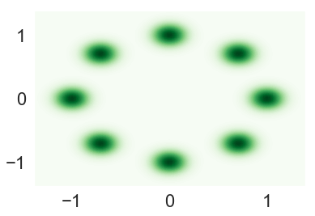
	</td>
	<td>
	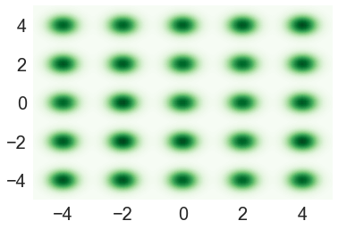
	</td>
	</tr>
	</table>

- Multivariate Structured Data: Generate samples from some pre-specified common causal strutures.
	<table>
	<tr> 
	<th>Chain</th>
	<th>Tree</th>
	</tr>
	<tr>
	<td>
	<figure>
	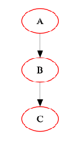
	</figure>
	</td>
	<td>
	<figure>
	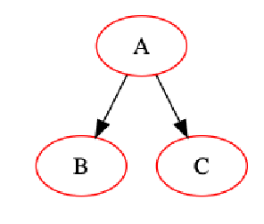
	</figure>
	</td>
	</tr>

	<tr> 
	<th>Fully Connected</th>
	<th>General</th>
	</tr>

	<tr>
	<td>
	<figure>
	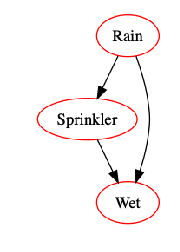
	</figure>
	</td>
	<td>
	<figure>
	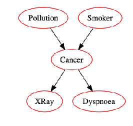
	</figure>
	</td>
	</tr>
	</table>


## Summary Examples

<table>
<tr>
<td>

</td>
<tr>
	<td>
	
	</td>
	<td>
	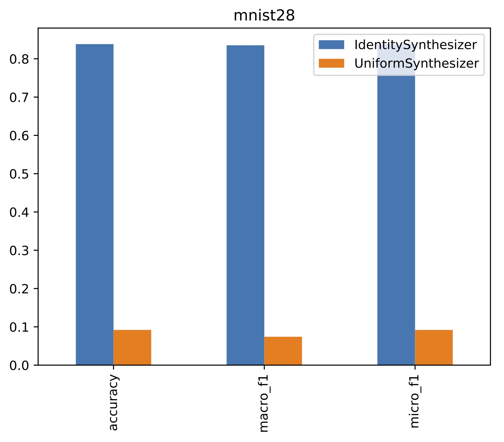
	</td>
</tr>
<tr>
	<td>
	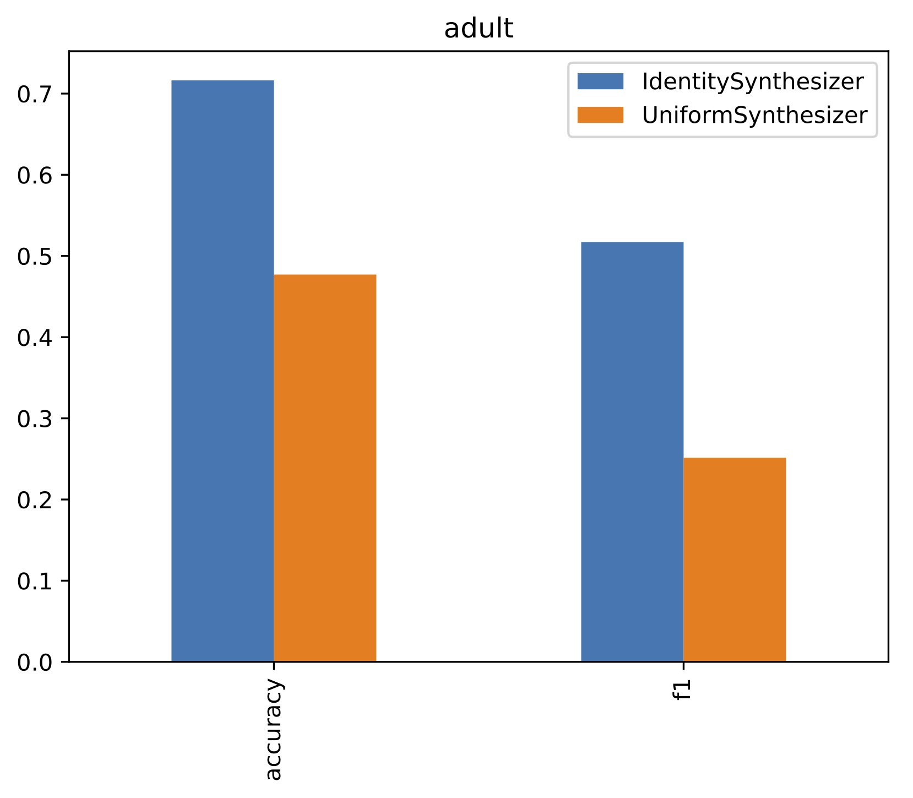
	</td>
	<td>
	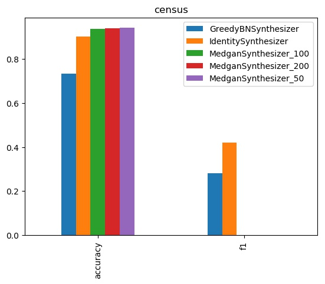
	</td>
</tr>
<tr>
	<td>
	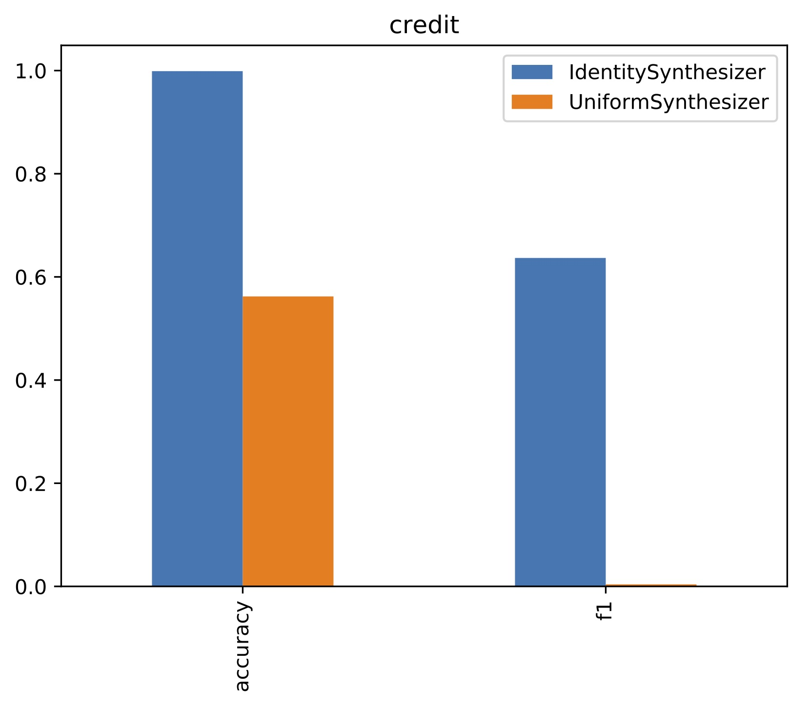
	</td>
	<td>
	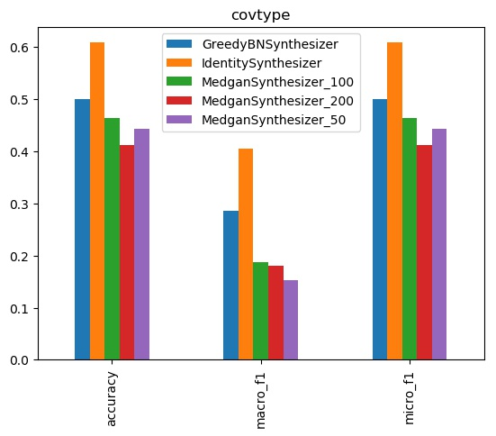
	</td>
</tr>

<tr>
	<td>
	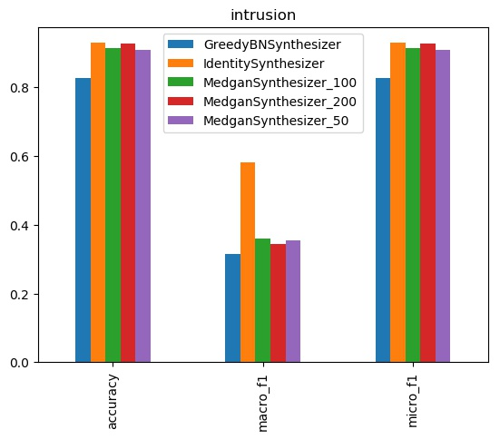
	</td>
	<td>
	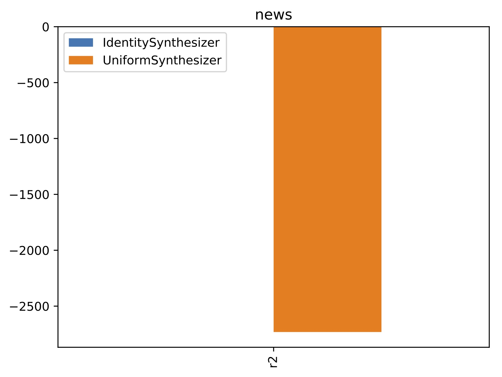
	</td>
</tr>

</table>

