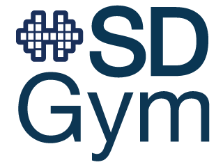

<p align="left">
  <a href="https://dai.lids.mit.edu">
    
  </a>
  <i>An Open Source Project from the <a href="https://dai.lids.mit.edu">Data to AI Lab, at MIT</a></i>
</p>

[](https://pypi.org/search/?c=Development+Status+%3A%3A+2+-+Pre-Alpha)
[](https://travis-ci.org/sdv-dev/SDGym)
[](https://pypi.python.org/pypi/sdgym)
[](https://pepy.tech/project/sdgym)



Benchmarking framework for Synthetic Data Generators

* Website: https://sdv.dev
* Documentation: https://sdv.dev/SDV
* Repository: https://github.com/sdv-dev/SDGym
* License: [MIT](https://github.com/sdv-dev/SDGym/blob/master/LICENSE)
* Development Status: [Pre-Alpha](https://pypi.org/search/?c=Development+Status+%3A%3A+2+-+Pre-Alpha)

# Overview

Synthetic Data Gym (SDGym) is a framework to benchmark the performance of synthetic data
generators based on [SDV](https://github.com/sdv-dev/SDV) and [SDMetrics](
https://github.com/sdv-dev/SDMetrics).

SDGym is a part of the [The Synthetic Data Vault](https://sdv.dev/) project.

## What is a Synthetic Data Generator?

A **Synthetic Data Generator** is a Python function (or method) that takes as input some
data, which we call the *real* data, learns a model from it, and outputs new *synthetic* data that
has the same structure and similar mathematical properties as the *real* one.

Please refer to the [synthesizers documentation](SYNTHESIZERS.md) for instructions about how to
implement your own Synthetic Data Generator and integrate with SDGym. You can also read about how
to use the ones already included in **SDGym** and see how to run them.

## Benchmark datasets

**SDGym** evaluates the performance of **Synthetic Data Generators** using *single table*,
*multi table* and *timeseries* datasets stored as CSV files alongside an [SDV Metadata](
https://sdv.dev/SDV/user_guides/relational/relational_metadata.html) JSON file.

Further details about the list of available datasets and how to add your own datasets to
the collection can be found in the [datasets documentation](DATASETS.md).

# Install

**SDGym** can be installed using the following commands:

**Using `pip`:**

```bash
pip install sdgym
```

**Using `conda`:**

```bash
conda install -c sdv-dev -c conda-forge sdgym
```

For more installation options please visit the [SDGym installation Guide](INSTALL.md)

# Usage

## Benchmarking your own Synthesizer

SDGym evaluates **Synthetic Data Generators**, which are Python functions (or classes) that take
as input some data, which we call the *real* data, learn a model from it, and output new
*synthetic* data that has the same structure and similar mathematical properties as the *real* one.

As an example, let use define a synthesizer function that applies the [GaussianCopula model from SDV
](https://sdv.dev/SDV/user_guides/single_table/gaussian_copula.html) with `gaussian` distribution.

```python3
import numpy as np
from sdv.tabular import GaussianCopula


def gaussian_copula(real_data, metadata):
    gc = GaussianCopula(default_distribution='gaussian')
    table_name = metadata.get_tables()[0]
    gc.fit(real_data[table_name])
    return {table_name: gc.sample()}
```

|:information_source: You can learn how to create your own synthesizer function [here](SYNTHESIZERS.md).|
|:-|

We can now try to evaluate this function on the `asia` and `alarm` datasets:

```python3
import sdgym

scores = sdgym.run(synthesizers=gaussian_copula, datasets=['asia', 'alarm'])
```

|:information_source: You can learn about different arguments for `sdgym.run` function [here](BENCHMARK.md).|
|:-|

The output of the `sdgym.run` function will be a `pd.DataFrame` containing the results obtained
by your synthesizer on each dataset.

| synthesizer     | dataset | modality     | metric          |      score | metric_time | model_time |
|-----------------|---------|--------------|-----------------|------------|-------------|------------|
| gaussian_copula | asia    | single-table | BNLogLikelihood |  -2.842690 |    2.762427 |   0.752364 |
| gaussian_copula | alarm   | single-table | BNLogLikelihood | -20.223178 |    7.009401 |   3.173832 |

## Benchmarking the SDGym Synthesizers

If you want to run the SDGym benchmark on the SDGym Synthesizers you can directly pass the
corresponding class, or a list of classes, to the `sdgym.run` function.

For example, if you want to run the complete benchmark suite to evaluate all the existing
synthesizers you can run (:warning: this will take a lot of time to run!):

```python
from sdgym.synthesizers import (
    CLBN, CopulaGAN, CTGAN, HMA1, Identity, Independent,
    MedGAN, PAR, PrivBN, SDV, TableGAN, TVAE,
    Uniform, VEEGAN)

all_synthesizers = [
    CLBN,
    CTGAN,
    CopulaGAN,
    HMA1,
    Identity,
    Independent,
    MedGAN,
    PAR,
    PrivBN,
    SDV,
    TVAE,
    TableGAN,
    Uniform,
    VEEGAN,
]
scores = sdgym.run(synthesizers=all_synthesizers)
```

For further details about all the arguments and possibilities that the `benchmark` function offers
please refer to the [benchmark documentation](BENCHMARK.md)

# Additional References

* Datasets used in SDGym are detailed [here](DATASETS.md).
* How to write a synthesizer is detailed [here](SYNTHESIZERS.md).
* How to use benchmark function is detailed [here](BENCHMARK.md).
* Detailed leaderboard results for all the releases are available [here](
https://docs.google.com/spreadsheets/d/1iNJDVG_tIobcsGUG5Gn4iLa565vVhz2U/edit).

# The Synthetic Data Vault

<p>
  <a href="https://sdv.dev">
    
  </a>
  <p><i>This repository is part of <a href="https://sdv.dev">The Synthetic Data Vault Project</a></i></p>
</p>

* Website: https://sdv.dev
* Documentation: https://sdv.dev/SDV
