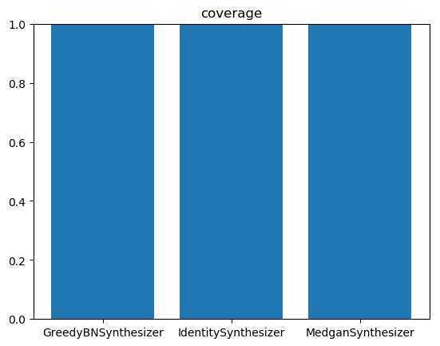
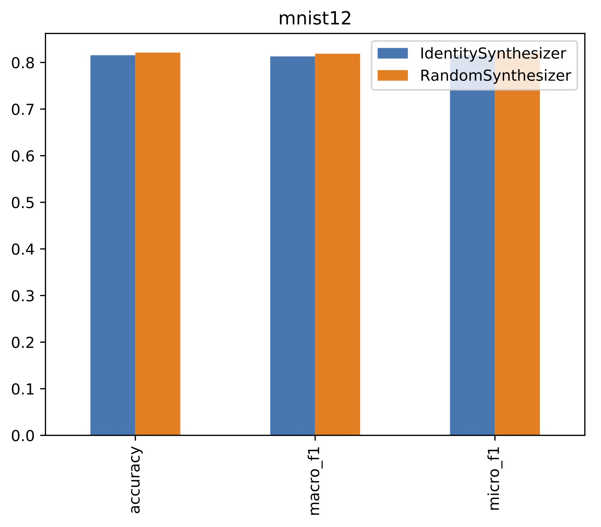

# Synthetic Data Generator Benchmark

This benchmark focuses on evaluating the performance of synthetic data generators on generating tabular non-series data.

All data are stored on Dropbox. 

## Data Format

To run this benchmark, you should first download all the data from dropbox and store them in `data` folder. So the whole working folder should look like

```
data/
|
|--real/
|  |
|  |--rdata1.npz
|  |
|  |--rdata1.json
|  |
|  |-- ...
|
|--simulate/
|  |
|  |--sdata1.npz
|  |
|  |--sdata1.json
|  |
|  |--...
|
|--evaluator/
|
|--synthesizer/
```

Each dataset comes with a npz data file and a json meta data. The meta file looks like

```
[
	{
		'name': None or str
		'type': 'Ordinal' or 'Categorical' or 'Continuous'
		
		# if Oridinal or Categorical:
		'size': integer
		'i2s': list of str
		
		#if Continuous:
		'min': float
		'max': float
	},
	...
]

```

The npz file includes 2 tables `train` and `test`. Each is a numpy array of (1~8 bytes) float or integer depending on the data. All continous columns are stored as is while categorical and oridinal columns are stored as integers (column be float because numpy array does not support mixed types). The mapping from integer to string is stored in meta file.

## Benchmark Framework

- Preprocess and get clean synthetic and real data sets. All code should goto `sdata_maker` and `rdata_maker`. (Once done, everything will be uploaded to S3, so that data are fixed for future use. 
- `synthesizer/` contains several baseline synthesizers. Each synthesizer can be easily excuted on one or more datasets multiple times by
	-`> python3 synthesizer/xxx_synthesizer.py --repeat 3 [dataset1, dataset2, ...]`
	- Excution results are stored in `output/` as several npz files. Each one is one version of synthetic data.
- Evaluators
	- `evaluator/evaluate.py` evaluates the output of one synthesizer on all datasets and store in a json file.
		- `> python3 evaluator/evaluate.py --synthetic output/XxxSynthesizer`
		- Results are stored as json file in `output/__result__`.
	- `evaluator/evaluate.py` generates the summary of results in `output/__result__`.
		- `> python3 evaluator/summary.py`
		- Outputs are stored as pdfs in `output/__summary__`.


## Summary Examples





## List of datasets and metric


### Synthetic

- 2D Ring
- 2D Grid
- high D Gaussian


### Real
- MINIST28: Use flatten 28\*28 pixels into 784 binary columns with an extra label column. 
- MINIST12: Reshape 28\*28 pixels into 12\*12 binary columns with an extra label column. 


```
- Covertype (8 continuous + 40 binary + 1 multi) `https://archive.ics.uci.edu/ml/datasets/Covertype`
- KDD Census data set `https://archive.ics.uci.edu/ml/datasets/Census-Income+%28KDD%29`
- KDD98 DNA `https://archive.ics.uci.edu/ml/datasets/KDD+Cup+1998+Data`
- Statlog (German Credit Data) Data Set 
- Blood Transfusion Service Center Data Set
- Tic-Tac-Toe https://archive.ics.uci.edu/ml/datasets/Tic-Tac-Toe+Endgame
```
